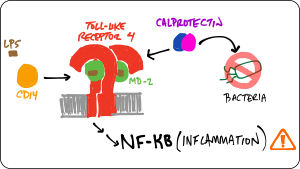
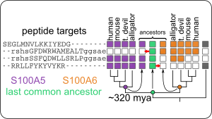

#Sequence Space

### An evolving protein must traverse sequence space.  What determines which pathways are accessible?

#### We found that...

+ [... "high-order" epistasis (multi-way interactions between mutations) are ubiquitous in experimental sequence spaces.](http://www.genetics.org/content/205/3/1079)
+ [... high-order epistasis shapes evolutionary trajectories. ](http://journals.plos.org/ploscompbiol/article?rev=2&id=10.1371/journal.pcbi.1005541)
+ [... high-order epistasis is a natural consequence of the thermodynamic ensemble populated by proteins.](http://www.pnas.org/content/114/45/11938.short)
+ [...we can build predictive models to fill in incompletely measured genotype-phenotype maps](#)

#### Current projects:

+ Can we find an observable signature of ensemble epistasis?
+ Can we use observed epistasis to dissect protein biophysics?
+ How does connectivity in a map scale with dimensionality?

----

# Evolution of innate immune proteins

### How do complicated, multi-component, multifunctional systems evolve?  

We are studying the co-evolution of five proteins that play intersecting roles in vertebrate innate immunity: Toll-like receptor 4, MD-2, CD14, S100A8, and S100A9.  Our goal is to better understand both how these molecules work and how they evolved their functions.  To achieve this goal, we are using phylogenetics, ancestral sequence reconstruction, ex vivo functional assays, biophysical measurements, simulations, and high-throughput experiments.  

####We found that...

+ [... an early calgranulin evolved in the amniote ancestor interacts non-specifically with TLR4.](https://www.frontiersin.org/articles/10.3389/fimmu.2018.00304/full)
+ [... the human TLR4/MD-2 complex has--since the human-mouse ancestor--evolved new specificity for pro-inflammatory signals.](https://onlinelibrary.wiley.com/doi/full/10.1002/pro.3644)
+ [... TLR4 evolved in the ancestor of bony vertebrates. Zebrafish TLR4 responds to the same signals that activate human TLR4.](https://www.biorxiv.org/content/10.1101/817528v1)
+ [... S100A9 activates TLR4 in a Zn(II)-independent fashion.](https://www.biorxiv.org/content/10.1101/796219v1)
+ [...S100A9 evolved multifunctionality through a pleiotropic substitution.](https://doi.org/10.1101/865493)

#### Current projects:

+ How does S100A9 activate Toll-like receptor 4?
+ How do evolutionary processes such as arms races shape the evolution and biochemistry of Toll-like receptor 4 and MD-2?

----

# Evolution of specificity

S100 proteins are small, calcium signaling molecules that bind to a wide variety of peptide targets.  We are using them as a model to understand how proteins evolve new specificity over evolutionary time.

#### We found that...

+ [...S100 proteins evolved in the ancestor of animals with spinal cords (urochordates).](http://journals.plos.org/plosone/article?id=10.1371/journal.pone.0164740)
+ [...transition metal binding is a conserved feature, shared by most S100 proteins, but the residues in the binding site are highly labile.](http://journals.plos.org/plosone/article?id=10.1371/journal.pone.0164740)
+ [...although S100A5 and S100A6 bind to an extraordinary variety of target peptides, this set of targets has been conserved for 320 million years.](https://pubs.acs.org/doi/abs/10.1021/acs.biochem.7b01086)
+ [...by combining high-throughput phage display with machine learning, we are able to define biochemical "rules" for specificity in these extraordinarily sloppy proteins](https://doi.org/10.1101/2020.06.02.131086)
+ [...that traditional ancestral sequence reconstruction studies may provide a biased view of the relative specificity of ancient proteins.](https://doi.org/10.1101/2020.05.27.120261)

#### Current projects:

+ What are the sets of biological targets for S100A5 and S100A6?

----

# Open source software

Our goal is to develop useful, high-quality, intuitive, and well-documented scientific software.  To see all Harms lab software, check out our [github page](https://github.com/harmslab).  

### pytc

pytc allows complicated global fits to Isothermal Titration Calorimetry data. Features include an intuitive API, Bayesian and maximum-likelihood analyses, and the ability to easily define new thermodynamic models.

[https://pytc.readthedocs.io](https://pytc.readthedocs.io/en/latest/)

[Duvvuri et al. (2018) Biochemistry 57(18):2578-2583](https://pubs.acs.org/doi/abs/10.1021/acs.biochem.7b01264)

### HOPS

HOPS (Hunches from Oregon about Peptide Specificity) takes high-throughput peptide scores (for example, enrichment values from a phage display experiment) and uses machine learning to train predictive models from the calculated physio-chemical properties of each peptide. 

https://github.com/harmslab/hops

[Wheeler et al. (2020) bioRxiv](https://doi.org/10.1101/2020.06.02.131086)

### epistasis

Software for studying statistical, high-order epistasis in genotype-phenotype maps. You can use this library to:

1. Decompose genotype-phenotype maps into high-order epistatic interactions
2. Find nonlinear scales in the genotype-phenotype map
3. Calculate the contributions of different epistatic orders
4. Estimate the uncertainty in the epistatic coefficients

[https://epistasis.readthedocs.io/](https://epistasis.readthedocs.io/?badge=latest)

[Sailer, Z. R., & Harms, M. J. (2017). Genetics, 205(3), 1079-1088.](http://www.genetics.org/content/205/3/1079)

### gpseer

GPSeer uses a simple, straightforward approach to infer the missing phenotypes from an incomplete genotype-phenotype map, with well-characterized uncertainty in its predictions. Such knowledge allows robust and statistically-informed analyses of features of the map, such as knowledge of possible evolutionary trajectories.	

https://gpseer.readthedocs.io

Publication in press

###genotype-phenotype map support libraries

Our studies of genotype-phenotype maps rely on a core set of libraries that we have released as individual packages. 

+ [gpmap](https://github.com/harmslab/gpmap): *A Python API for managing genotype-phenotype map data*: GPMap defines a flexible object for managing genotype-phenotype (GP) map data. At it's core, it stores all data in Pandas DataFrames and thus, interacts seamlessly with the PyData egosystem.
+ [gpgraph](https://github.com/harmslab/gpgraph): *Genotype-phenotype maps in NetworkX*. GPGraph follows NetworkX syntax. Initialize a graph, add the genotype-phenotype map object, and draw the graph. 
+ [gpvolve](https://gpvolve.readthedocs.io/): *A Python API for simulating and analyzing evolution in genotype-phenotype space.* This can be used to build a Markov State Model from a genotype-phenotype-map, find clusters of genotypes that represent metastable states of the system, compute fluxes through the map using Transition Path Theory, and visualize the outputs from the above. 

